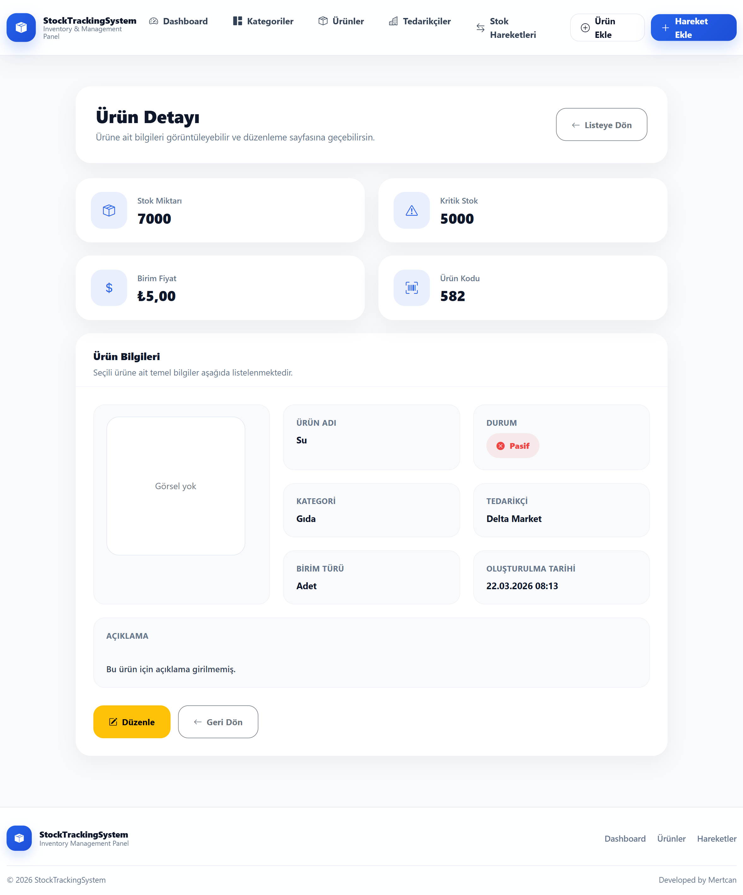
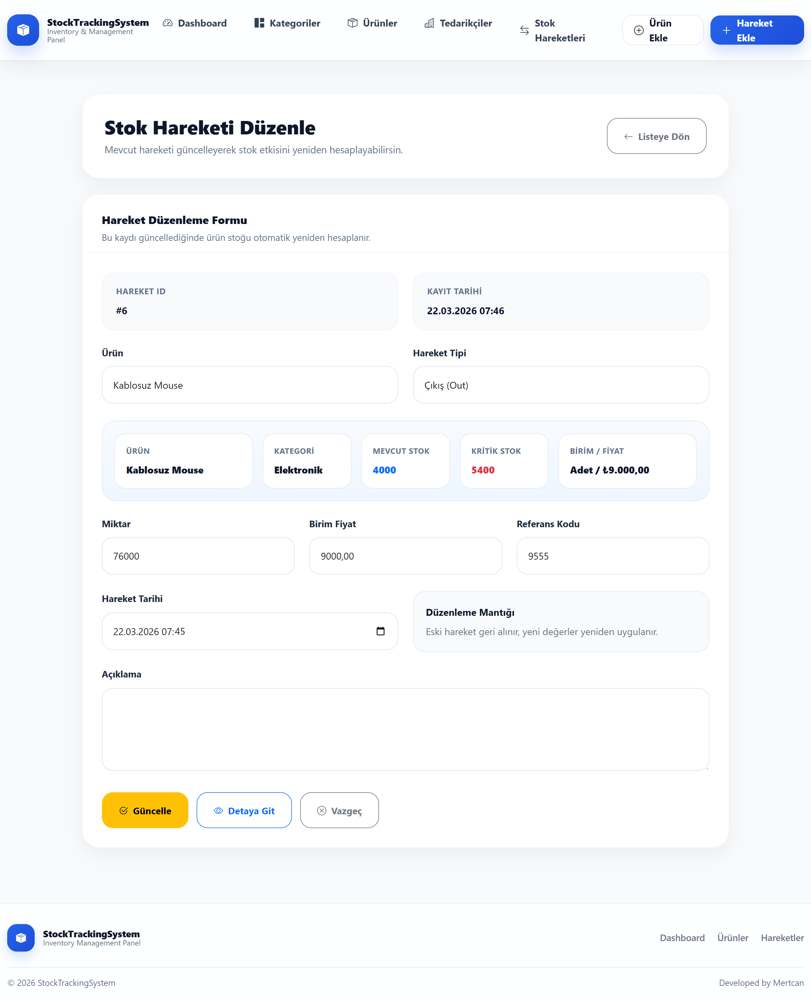
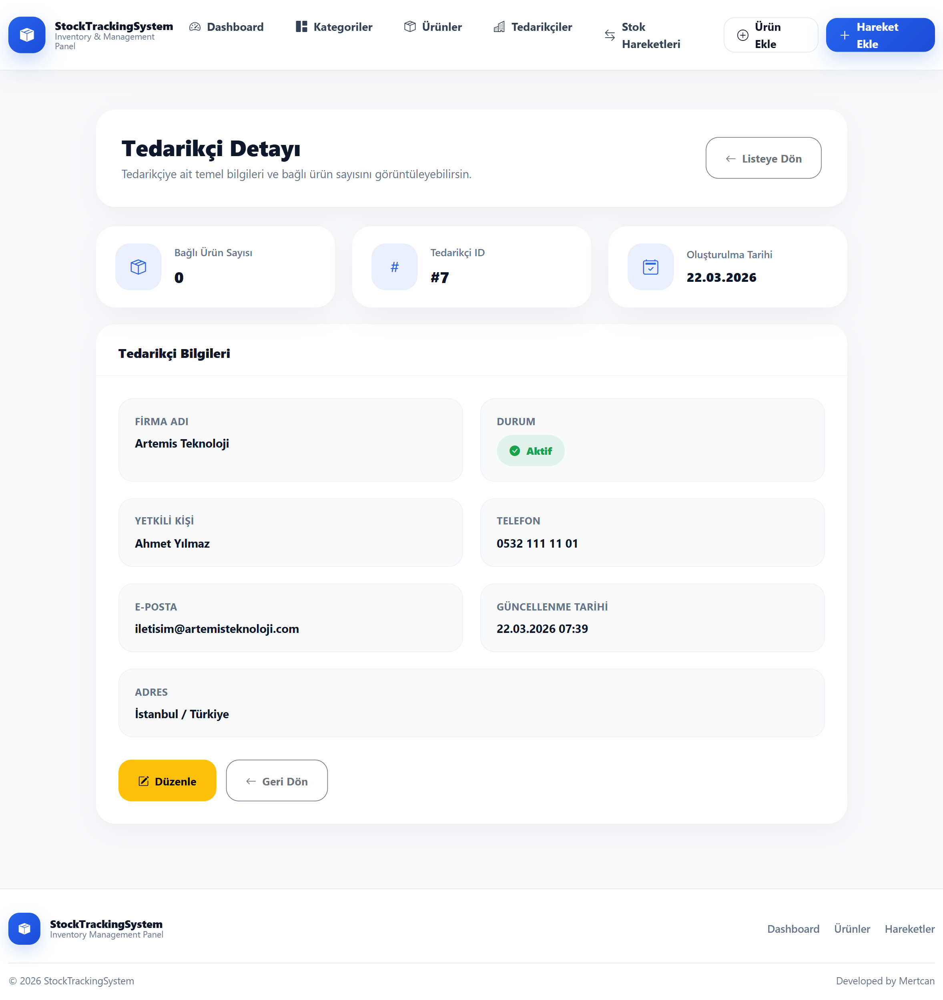
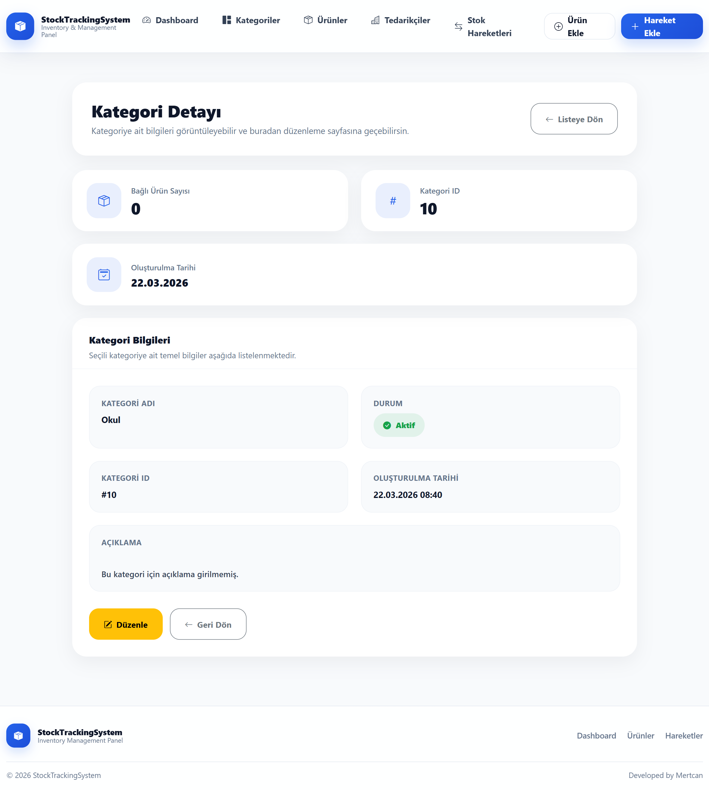

# 🚀 Stock Tracking System

> ⚡ Developed with modern admin panel architecture and real-world stock management logic

A fully dynamic **stock tracking and management system** built with **ASP.NET Core MVC, Entity Framework Core, and SQL Server**.

This project provides a complete solution for managing **products, suppliers, categories, and stock movements** through a powerful and user-friendly **admin dashboard**.

---

## 🎬 Demo

> Full system overview (dashboard, stock flow, CRUD operations)


### ⚡ AJAX Live Update


### 🔄 Stock Movement Create


---

## ✨ Key Features

- 📦 Product Management (CRUD)  
- 🏢 Supplier Management (CRUD + status toggle)  
- 🗂️ Category Management  
- 🔄 Stock In / Stock Out System  
- 📊 Real-time Dashboard Statistics  
- ⚡ AJAX-based Status Updates (Active / Passive toggle)  
- 🧾 Audit Log System (tracking all actions)  
- 🔍 Advanced Filtering & Search (supplier panel)  
- 📅 Date-based filtering & sorting  
- 🎨 Modern UI (custom CSS + Bootstrap 5)  

---

## 🛠️ Tech Stack

- ASP.NET Core MVC  
- Entity Framework Core  
- Microsoft SQL Server  
- Bootstrap 5  
- JavaScript (AJAX, Fetch API)  
- HTML5 / CSS3  

---

## 🎥 Feature Demonstrations

### 📦 Product & Stock Management

| Product List | Product Create |
|--------------|----------------|
|  |  |

| Product Details | Product Edit |
|-----------------|--------------|
|  |  |

---

### 🔄 Stock Movement System

| Stock List | Create Movement |
|------------|-----------------|
|  |  |

| Details | Edit |
|---------|------|
|  |  |

---

### 🏢 Supplier Management

| Supplier List | Create |
|---------------|--------|
|  |  |

| Details | Edit |
|---------|------|
|  |  |

---

### 🗂️ Category Management

| Category List | Create |
|---------------|--------|
|  |  |

| Details | Edit |
|---------|------|
|  |  |

---

### 📊 Dashboard Overview


---

## 🧠 Database Design

> Relational database structure designed for scalability


---

## ⚙️ Installation

```bash
git clone https://github.com/MertcanKayirici/StockManagementSystem.git
```
1️⃣ Database Setup

Run SQL script:

/Database/StockTrackingDb.sql
2️⃣ Configure Connection String
"ConnectionStrings": {
  "DefaultConnection": "Server=.;Database=StockTrackingDb;Trusted_Connection=True;"
}
3️⃣ Run Project
dotnet run

---

## 📌 Architecture Highlights
- Layered MVC structure
- Entity relationships (Foreign Keys & constraints)
- Clean UI component system
- AJAX-driven interactions
- Logging & tracking system

---

## 🚀 Future Improvements
📊 Chart.js dashboard (monthly / yearly stats)
🔔 Notification system (low stock alerts)
📱 Mobile-first UI improvements
🔐 Role-based authentication
📡 RESTful API layer

---

## 👨‍💻 Author

Mertcan Kayırıcı

GitHub: https://github.com/MertcanKayirici
LinkedIn: https://www.linkedin.com/in/mertcankayirici
⭐️ Support

If you like this project, don't forget to star ⭐ the repository.
